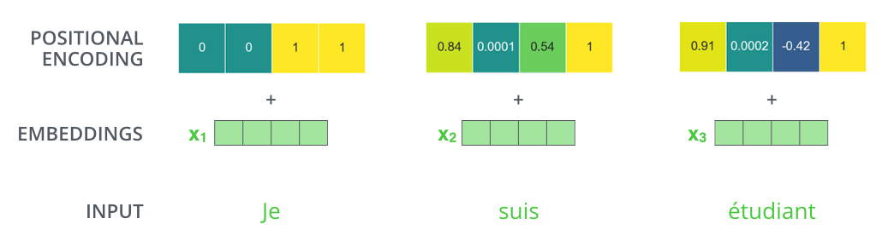

目录

- Transformer

  - [1. 前言](https://www.cnblogs.com/zhongzhaoxie/p/13064374.html#1-前言)

  - 2. Transformer详解

    - [2.1 Transformer整体结构](https://www.cnblogs.com/zhongzhaoxie/p/13064374.html#21-transformer整体结构)
    - [2.2 输入编码](https://www.cnblogs.com/zhongzhaoxie/p/13064374.html#22-输入编码)
    - [2.3 Self-Attention](https://www.cnblogs.com/zhongzhaoxie/p/13064374.html#23-self-attention)
    - [2.4 Multi-Head Attention](https://www.cnblogs.com/zhongzhaoxie/p/13064374.html#24-multi-head-attention)
    - [2.5 位置编码](https://www.cnblogs.com/zhongzhaoxie/p/13064374.html#25-位置编码)
    - [2.6 残差结构](https://www.cnblogs.com/zhongzhaoxie/p/13064374.html#26-残差结构)
    - [2.7 解码器结构](https://www.cnblogs.com/zhongzhaoxie/p/13064374.html#27-解码器结构)
    - [2.8 The Final Linear and Softmax Layer](https://www.cnblogs.com/zhongzhaoxie/p/13064374.html#28-the-final-linear-and-softmax-layer)
    - [2.9 损失函数](https://www.cnblogs.com/zhongzhaoxie/p/13064374.html#29-损失函数)

  - [3. 总结](https://www.cnblogs.com/zhongzhaoxie/p/13064374.html#3-总结)

  - [4. 相关参考资料](https://www.cnblogs.com/zhongzhaoxie/p/13064374.html#4-相关参考资料)


## Transformer

### 1. 前言

正如论文的题目所说的，Transformer中抛弃了传统的CNN和RNN，整个网络结构完全是由Attention机制组成。更准确地讲，Transformer由且仅由self-Attenion和Feed Forward Neural Network组成。一个基于Transformer的可训练的神经网络可以通过堆叠Transformer的形式进行搭建，作者的实验是通过搭建编码器和解码器各6层，总共12层的Encoder-Decoder，并在机器翻译中刷新了BLEU值。

作者采用Attention机制的原因是考虑到RNN（或者LSTM，GRU等）的计算限制为是顺序的，也就是说RNN相关算法只能从左向右依次计算或者从右向左依次计算，这种机制带来了两个问题：

1. 时间片t的计算依赖t-1时刻的计算结果，这样限制了模型的并行能力；
2. 顺序计算的过程中信息会丢失，尽管LSTM等门机制的结构一定程度上缓解了长期依赖的问题，但是对于特别长的依赖关系,LSTM依旧无能为力。

Transformer的提出解决了上面两个问题，首先它使用了Attention机制，将序列中的任意两个位置之间的距离是缩小为一个常量；其次它不是类似RNN的顺序结构，因此具有更好的并行性，符合现有的GPU框架。

说明：该笔记总结的图片来源于[Jay Alammar](http://jalammar.github.io/illustrated-transformer/)的博客，前言部分来自知乎[刘岩](https://zhuanlan.zhihu.com/p/48508221)的总结, 谢谢两位大佬的分享。本篇是结合自己的理解翻译中文，有错误的地方，请在评论区中留言。

### 2. Transformer详解

#### 2.1 Transformer整体结构

论文中的验证Transformer的实验室基于机器翻译的，下面我们就以机器翻译为例子详细剖析Transformer的结构，在机器翻译中，Transformer可概括为如图1


 图1：Transformer用于机器翻译

Transformer的本质上是一个Encoder-Decoder的结构，那么图1可以表示为图2的结构


图2：Transformer的Encoder-Decoder结构

如论文中所设置的，编码器由6个编码block组成，同样解码器是6个解码block组成。与所有的生成模型相同的是，编码器的输出会作为解码器的输入，如图3所示：


​ 图3：Transformer的Encoder和Decoder均由6个block堆叠而成

我们继续分析每个encoder的详细结构：在Transformer的encoder中，数据首先会经过一个叫做‘self-attention’的模块得到一个加权之后的特征向量Z𝑍，这个便Z𝑍是论文公式1中的Attension(Q,K,V)𝐴𝑡𝑡𝑒𝑛𝑠𝑖𝑜𝑛(𝑄,𝐾,𝑉) :

 Attension(Q,K,V)=softmax(QKTd1/2k)V𝐴𝑡𝑡𝑒𝑛𝑠𝑖𝑜𝑛(𝑄,𝐾,𝑉)=𝑠𝑜𝑓𝑡𝑚𝑎𝑥(𝑄𝐾𝑇𝑑𝑘1/2)𝑉

第一次看到这个公式你可能会一头雾水，在后面的文章中我们会揭开这个公式背后的实际含义，在这一段暂时将其叫做Z𝑍 。得到Z𝑍之后，它会被送到encoder的下一个模块，即Feed Forward Neural Network。这个全连接有两层，第一层的激活函数是ReLU，第二层是一个线性激活函数，可以表示为：

FFN=max(0,ZW1+b1)W2+b2𝐹𝐹𝑁=𝑚𝑎𝑥(0,𝑍𝑊1+𝑏1)𝑊2+𝑏2

Encoder的结构如图4所示


 图4：Transformer由self-attention和Feed Forward neural network组成

Decoder的结构如图5所示，它和encoder的不同之处在于Decoder多了一个Encoder-Decoder Attention，两个Attention分别用于计算输入和输出的权值

1. Self-Attention：当前翻译和已经翻译的前文之间的关系；
2. Encoder-Decoder Attention：当前翻译和编码的特征向量之间的关系。


 图5：Transformer的解码器由self-attention，encoder-decoder attention以及FFNN组成

#### 2.2 输入编码

1.1节介绍的就是Transformer的主要框架，下面我们将介绍它的输入数据。如图6所示，首先通过Word2Vec等词嵌入方法将输入语料转化成特征向量，论文中使用的词嵌入的维度为dmodel=512𝑑𝑚𝑜𝑑𝑒𝑙=512


​ 图6：单词的输入编码

在最底层的block中，x𝑥 将直接作为Transformer的输入，而在其他层中，输入则是上一个block的输出。为了画图更简单，我们使用更简单的例子来表示接下来的过程，如图7所示：


​ 图7：输入编码作为一个tensor输入到encoder中

#### 2.3 Self-Attention

Self-Attention是Transformer最核心的内容，然而作者并没有详细讲解，下面我们来补充一下作者遗漏的地方。回想Bahdanau等人提出的用Attention，其核心内容是为输入向量的每个单词学习一个权重，例如在下面的例子中我们判断it代指的内容

```
The animal didn't cross the street because it was too tired
```

通过加权之后可以得到类似图8的加权情况，在讲解self-attention的时候我们也会使用图8类似的表示方式：


​ 图8：经典Attention可视化示例图

在self-attention中，每个单词有3个不同的向量，它们分别是Query向量（Q𝑄），Key向量（K𝐾）和Value向量（V𝑉），长度均是64。它们是通过3个不同的权值矩阵由嵌入向量 X𝑋 乘以三个不同的权值矩阵WQ𝑊𝑄, WK𝑊𝐾, WV𝑊𝑉 得到，其中三个矩阵的尺寸也是相同的。均是512×64512×64 。


​ 图9：Q，K，V的计算示例图

那么Query，Key，Value是什么意思呢？它们在Attention的计算中扮演着什么角色呢？我们先看一下Attention的计算方法，整个过程可以分成7步：

1. 如上文，将输入单词转化成嵌入向量；
2. 根据嵌入向量得到q𝑞, k𝑘, v𝑣 三个向量；
3. 为每个向量计算一个score：score=q∗k𝑠𝑐𝑜𝑟𝑒=𝑞∗𝑘 ；
4. 为了梯度的稳定，Transformer使用了score归一化，即除以d1/2k𝑑𝑘1/2；
5. 对score施以softmax激活函数；
6. softmax点乘Value值v𝑣 ，得到加权的每个输入向量的评分v𝑣 ；
7. 相加之后得到最终的输出结果z=∑v𝑧=∑𝑣 。

上面步骤的可以表示为图10的形式。


​ 图10：Self-Attention计算示例图

实际计算过程中是采用基于矩阵的计算方式，那么论文中的Q𝑄, V𝑉, K𝐾 的计算方式如图11：


 图11：Q，V，K的矩阵表示

如图12所示的矩阵形式，这个softmax分数决定了每个单词对编码当下位置（“Thinking”）的贡献。显然，已经在这个位置上的单词将获得最高的softmax分数，上述第三步和第四步是将分数除以8(8是论文中使用的键向量的维数64的平方根，这会让梯度更稳定。这里也可以使用其它值，8只是默认值)，然后通过softmax传递结果。softmax的作用是使所有单词的分数归一化，得到的分数都是正值且和为1。


 图12：Self-Attention的矩阵表示

这里也就是公式1的计算方式。在self-attention需要强调的最后一点是其采用了残差网络中的short-cut结构，目的当然是解决深度学习中的退化问题，得到的最终结果如图13。

​ 图13：Self-Attention中的short-cut连接

#### 2.4 Multi-Head Attention

Multi-Head Attention相当于hℎ个不同的self-attention的集成（ensemble），在这里我们以h=8ℎ=8举例说明。Multi-Head Attention的输出分成3步：

1. 将数据X𝑋分别输入到图13所示的8个self-attention中，得到8个加权后的特征矩阵Zi,i∈1,2,...,8𝑍𝑖,𝑖∈1,2,...,8。
2. 将8个Zi𝑍𝑖按列拼成一个大的特征矩阵(512,64×8)(512,64×8)。
3. 特征矩阵经过一层全连接后得到输出Z𝑍。

整个过程如图14所示：

​ 图14：Multi-Head Attention

同self-attention一样，multi-head attention也加入了short-cut机制。现在我们已经触及了注意力的头，让我们重新审视我们之前的例子，看看不同的注意力头在哪里聚焦，因为我们在我们的例句中编码“it”这个词：


当我们对“它”这个词进行编码时，一个注意力的焦点主要集中在“动物”上，而另一个注意力集中在“疲惫” - 从某种意义上说，模型对“它”这个词的表现形式在某些表现形式中有所表现。 “动物”和“疲倦”。

#### 2.5 位置编码

截止目前为止，我们介绍的Transformer模型并没有捕捉顺序序列的能力，也就是说无论句子的结构怎么打乱，Transformer都会得到类似的结果。换句话说，Transformer只是一个功能更强大的词袋模型而已。

为了解决这个问题，论文中在编码词向量时引入了位置编码（Position Embedding）的特征。具体地说，位置编码会在词向量中加入了单词的位置信息，这样Transformer就能区分不同位置的单词了。

那么怎么编码这个位置信息呢？常见的模式有：a. 根据数据学习；b. 自己设计编码规则。在这里作者采用了第二种方式。那么这个位置编码该是什么样子呢？通常位置编码是一个长度为 dmodel𝑑𝑚𝑜𝑑𝑒𝑙 的特征向量，这样便于和词向量进行单位加的操作，如图16。

 图16：Position Embedding

论文给出的编码公式如下：


PE(pos,2i)=sin(pos100002idmodel)𝑃𝐸(𝑝𝑜𝑠,2𝑖)=𝑠𝑖𝑛(𝑝𝑜𝑠100002𝑖𝑑𝑚𝑜𝑑𝑒𝑙)


PE(pos,2i+1)=cos(pos100002idmodel)𝑃𝐸(𝑝𝑜𝑠,2𝑖+1)=𝑐𝑜𝑠(𝑝𝑜𝑠100002𝑖𝑑𝑚𝑜𝑑𝑒𝑙)


在上式中，pos𝑝𝑜𝑠 表示单词的位置， i𝑖 表示单词的维度。关于位置编码的实现可在Google开源的算法中`get_timing_signal_1d()`函数找到对应的代码。

作者这么设计的原因是考虑到在NLP任务重，除了单词的绝对位置，单词的相对位置也非常重要。根据公式 sin(α+β)=sinαcosβ+cosαsinβ𝑠𝑖𝑛(𝛼+𝛽)=𝑠𝑖𝑛𝛼𝑐𝑜𝑠𝛽+𝑐𝑜𝑠𝛼𝑠𝑖𝑛𝛽 以及 cos(α+β)=cosαcosβ−sinαsinβ𝑐𝑜𝑠(𝛼+𝛽)=𝑐𝑜𝑠𝛼𝑐𝑜𝑠𝛽−𝑠𝑖𝑛𝛼𝑠𝑖𝑛𝛽，这表明位置k+p𝑘+𝑝 的位置向量可以表示为位置k𝑘的特征向量的线性变化，这为模型捕捉单词之间的相对位置关系提供了非常大的便利。

如果我们假设嵌入的维数为4，那么实际的位置编码将如下所示：

 图17：词嵌入大小为4的位置编码

在下图中，每行对应矢量的位置编码。因此第一行将是我们添加到输入序列中嵌入第一个单词的向量。每行包含512个值 - 每个值介于1和-1之间。我们对它们进行了颜色编码，使图案可见。
 图18：位置编码的可视化

嵌入大小为512（列）的20个字（行）的位置编码的真实示例。你可以看到它在中心区域分成两半。这是因为左半部分的值由一个函数（使用正弦）生成，而右半部分由另一个函数（使用余弦）生成。然后将它们连接起来以形成每个位置编码矢量。

#### 2.6 残差结构

如果我们要将向量和与self-attention相关的图层规范操作可视化，它将如下所示：
 图19：self-attention的图层可视化


这也适用于解码器的子层。如果我们将2个堆叠编码器和解码器图层可视化，它看起来像这样：
 图20：编码器和解码器的可视化

#### 2.7 解码器结构

既然我们已经涵盖了编码器方面的大多数概念，我们基本上都知道解码器的组件是如何工作的。但是让我们来看看它们如何协同工作。 编码器通过处理输入序列开始。然后将顶部编码器的输出变换成一组注意力向量K和V.这些将由每个解码器在其“编码器 - 解码器注意力”层中使用，这有助于解码器关注输入序列中的适当位置：
 图21：解码过程

完成编码阶段后，我们开始解码阶段。解码阶段中的每个步骤输出来自输出序列的元素（在这种情况下为英语翻译句子）。

以下步骤重复该过程，直到到达特殊符号，表明Transformer解码器已完成其输出。每个步骤的输出在下一个时间步骤中被馈送到底部解码器，并且解码器像编码器那样冒泡它们的解码结果。就像我们对编码器输入所做的那样，我们在这些解码器输入中嵌入并添加位置编码，以指示每个字的位置。

​ 图22：关注输出序列的解码过程

解码器中的self-attention层以与编码器中的self-attention层略有不同的方式操作： 在解码器中，仅允许self-attention层关注输出序列中的较早位置。这是通过在self-attension计算中的softmax步骤之前屏蔽未来位置（将它们设置为-inf）来完成的。 “Encoder-Decoder Attention”层就像多头self-attention一样，除了它从它下面的层创建其查询矩阵，并从编码器堆栈的输出中获取键和值矩阵。

#### 2.8 The Final Linear and Softmax Layer

解码器堆栈输出浮点数向量。我们如何将其变成一个单词？这是最终线性层的工作，其后是Softmax层。 线性层是一个简单的全连接的神经网络，它将解码器堆栈产生的向量投影到一个更大的向量中，称为logits向量。

让我们假设我们的模型知道从训练数据集中学到的10,000个独特的英语单词（我们的模型的“输出词汇表”）。这将使logits向量10,000个细胞（cell）宽 - 每个细胞（cell）对应于一个唯一单词的得分。这就是我们如何解释模型的输出，然后是线性层。 然后softmax层将这些分数转换为概率（全部为正，全部加起来为1.0）。选择具有最高概率的单元，并且将与其相关联的单词作为该时间步的输出。

 图23：关注输出序列的解码过程

该图从底部开始，向量的产生为解码器堆栈的输出。然后它变成输出字。

#### 2.9 损失函数

现在我们已经通过训练有素的Transformer覆盖了整个前向过程，看一下寻两模型的直觉是有用的。 在训练期间，未经训练的模型将通过完全相同的前向过程。但是由于我们在标记的训练数据集上训练它，我们可以将其输出与实际正确的输出进行比较。 为了想象这一点，让我们假设我们的输出词汇只包含六个单词（“a”，“am”，“i”，“thanks”，“student”和“”（“句末”的缩写）） 。


 图24： 词对应索引

在我们开始训练之前，我们模型的输出词汇是在预处理阶段创建的。一旦我们定义了输出词汇表，我们就可以使用相同宽度的向量来表示词汇表中的每个单词。这也称为“one-hot”编码。例如，我们可以使用以下向量指示单词“am”：

 图25：输出词汇的编码

在回顾一下之后，让我们讨论一下模型的损失函数 - 我们在训练阶段优化的指标，以引导一个训练有素且令人惊讶的精确模型。

假设我们正在训练我们的模型。说这是我们在训练阶段的第一步，我们正在训练它的一个简单例子 - 将“merci”翻译成“谢谢”。 这意味着，我们希望输出是指示“谢谢”一词的概率分布。但由于这种模式还没有接受过训练，所以这种情况不太可能发生。


​ 图26：输出词汇的编码

由于模型的参数（权重）都是随机初始化的，因此（未经训练的）模型产生具有每个单元/单词的任意值的概率分布。我们可以将它与实际输出进行比较，然后使用反向传播调整所有模型的权重，使输出更接近所需的输出。

你如何比较两个概率分布？我们简单地从另一个中减去一个。有关更多详细信息，请查看交叉熵和Kullback-Leibler散度。

但请注意，这是一个过于简单的例子。更现实的是，我们将使用长于一个单词的句子。例如 - 输入：“jesuisétudiant”和预期输出：“我是学生”。这真正意味着，我们希望我们的模型能够连续输出概率分布，其中：

1. 每个概率分布由宽度为vocab_size的向量表示（在我们的前面示例中为6，但更实际地是3,000或10,000的数字）
2. 第一概率分布在与单词“i”相关联的单元处具有最高概率
3. 第二概率分布在与单词“am”相关联的单元格中具有最高概率
4. 依此类推，直到第五个输出分布表示'<句末结束>'符号，其中还有一个与10,000元素词汇表相关联的单元格。

 图27： 目标词的真实位置

我们将在一个样本句子的训练示例中训练我们的模型的目标概率分布。在足够大的数据集上训练模型足够的时间之后，我们希望产生的概率分布看起来像这样：

​ 图28： 模型预测单词的位置

希望通过训练，模型将输出我们期望的正确翻译。当然，这个短语是否是训练数据集的一部分并不是真正的指示（参见：交叉验证）。请注意，即使不太可能是该时间步的输出，每个位置都会获得一点概率 - 这是softmax非常有用的属性，有助于训练过程。

现在，因为模型一次生成一个输出，我们可以假设模型从该概率分布中选择具有最高概率的单词并丢弃其余的单词。这是一种方法（称为贪婪解码）。另一种方法是保持前两个词（例如，'I'和'a'），然后在下一步中，运行模型两次：一旦假设第一个输出位置是单词'I'，另一次假设第一个输出位置是单词'me'，并且考虑到＃1和＃2位置保留的任何版本产生的错误都较少。我们重复这个位置＃2和＃3 ......等。这种方法称为“波束搜索”，在我们的例子中，beam_size是两个（因为我们在计算位置＃1和＃2的波束后比较了结果），top_beams也是两个（因为我们保留了两个词）。这些都是您可以尝试的超参数。

### 3. 总结

优点：

1. 虽然Transformer最终也没有逃脱传统学习的套路，Transformer也只是一个全连接（或者是一维卷积）加Attention的结合体。但是其设计已经足够有创新，因为其抛弃了在NLP中最根本的RNN或者CNN并且取得了非常不错的效果，算法的设计非常精彩，值得每个深度学习的相关人员仔细研究和品位。
2. Transformer的设计最大的带来性能提升的关键是将任意两个单词的距离变成1，这对解决NLP中棘手的长期依赖问题是非常有效的。
3. Transformer不仅仅可以应用在NLP的机器翻译领域，甚至可以不局限于NLP领域，是非常有科研潜力的一个方向。
4. 算法的并行性非常好，符合目前的硬件（主要指GPU）环境。

**缺点**：

1. 粗暴的抛弃RNN和CNN虽然非常炫技，但是它也使模型丧失了捕捉局部特征的能力，RNN + CNN + Transformer的结合可能会带来更好的效果。
2. Transformer失去的位置信息其实在NLP中非常重要，而论文中在特征向量中加入Position Embedding也只是一个权宜之计，并没有改变Transformer结构上的固有缺陷。

### 4. 相关参考资料

Transformer论文及相关代码：

- Read the [Attention Is All You Need](https://arxiv.org/abs/1706.03762) paper, the Transformer blog post ([Transformer: A Novel Neural Network Architecture for Language Understanding](https://ai.googleblog.com/2017/08/transformer-novel-neural-network.html)), and the [Tensor2Tensor announcement](https://ai.googleblog.com/2017/06/accelerating-deep-learning-research.html).
- Watch [Łukasz Kaiser’s talk](https://www.youtube.com/watch?v=rBCqOTEfxvg) walking through the model and its details
- Play with the [Jupyter Notebook provided as part of the Tensor2Tensor repo](https://colab.research.google.com/github/tensorflow/tensor2tensor/blob/master/tensor2tensor/notebooks/hello_t2t.ipynb)
- Explore the [Tensor2Tensor repo](https://github.com/tensorflow/tensor2tensor).

Transformer相关工作：

- [Depthwise Separable Convolutions for Neural Machine Translation](https://arxiv.org/abs/1706.03059)
- [One Model To Learn Them All](https://arxiv.org/abs/1706.05137)
- [Discrete Autoencoders for Sequence Models](https://arxiv.org/abs/1801.09797)
- [Generating Wikipedia by Summarizing Long Sequences](https://arxiv.org/abs/1801.10198)
- [Image Transformer](https://arxiv.org/abs/1802.05751)
- [Training Tips for the Transformer Model](https://arxiv.org/abs/1804.00247)
- [Self-Attention with Relative Position Representations](https://arxiv.org/abs/1803.02155)
- [Fast Decoding in Sequence Models using Discrete Latent Variables](https://arxiv.org/abs/1803.03382)
- [Adafactor: Adaptive Learning Rates with Sublinear Memory Cost](https://arxiv.org/abs/1804.04235